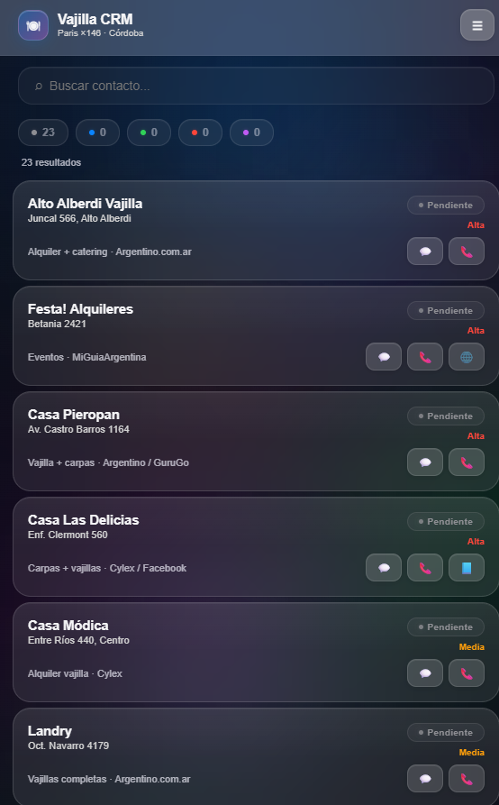
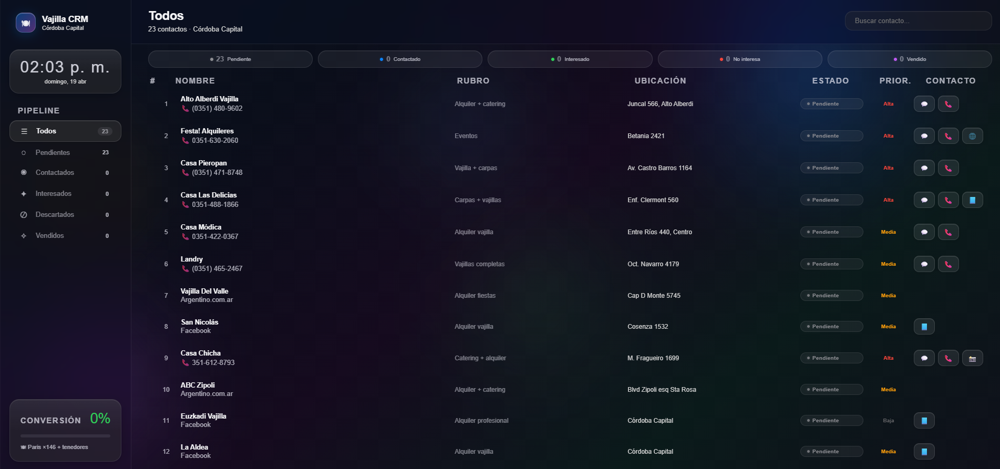

# 🍽 Vajilla CRM — Córdoba Capital




Mini CRM para vender vajillas Paris (cucharas de postre ×146 + tenedores) a negocios de alquiler en Córdoba.

## Diseño

- **iOS 26 Liquid Glass** — glassmorphism real con `backdrop-filter`
- **Responsive** — Mobile (cards + bottom sheets) / Desktop (sidebar + tabla + panel lateral)
- Orbes de color ambiental flotantes
- Cero dependencias de UI externas

## Instalación

```bash
cd crm-vajilla-cba
npm install
npm run dev
# → http://localhost:5173
```

## Build

```bash
npm run build
# Output en /dist → deployar en Vercel/Netlify
```

## Estructura

```
src/
├── App.jsx                  # Layout responsive (mobile vs desktop)
├── main.jsx                 # Mount
├── hooks/
│   └── useIsDesktop.js      # Hook para detectar breakpoint 768px
├── data/
│   ├── contacts.js          # 23 contactos investigados
│   └── constants.js         # Estados, prioridades, nav items
├── components/
│   ├── AmbientOrbs.jsx      # Orbes animados de fondo
│   ├── Sidebar.jsx          # Sidebar con reloj + pipeline (solo desktop)
│   ├── Header.jsx           # Barra superior (logo + menú en mobile)
│   ├── StatsBar.jsx         # Chips de filtro (scroll horizontal mobile / expandidos desktop)
│   ├── ContactCard.jsx      # Card (mobile) / Table row (desktop)
│   ├── ChannelButtons.jsx   # Botones WA/Tel/IG/FB/Web (solo si existen)
│   ├── DetailSheet.jsx      # Bottom sheet (mobile) / Side panel (desktop)
│   ├── MenuSheet.jsx        # Pipeline menu (solo mobile)
│   └── StatusChip.jsx       # Pill de estado con glow
└── styles/
    └── global.css           # Variables + glass + animaciones + media queries
```

## Responsive

| Feature | Mobile (<768px) | Desktop (≥768px) |
|---|---|---|
| Navegación | Menú hamburguesa → bottom sheet | Sidebar fijo con reloj |
| Lista | Cards apiladas | Tabla con columnas |
| Detalle | Bottom sheet con overlay | Panel lateral derecho |
| Stats | Chips scroll horizontal | Chips expandidos |

## Funcionalidad

- Buscar por nombre o dirección
- Filtrar por estado y prioridad
- WhatsApp directo (wa.me/54...)

- 
- Llamar (tel:+54...)
- Instagram / Facebook / Web directos
- Botones solo aparecen si el canal existe
- Cambiar estado y prioridad
- Notas personales por contacto
- Barra de conversión en tiempo real

- <!-- v2: auth redesign branch -->
